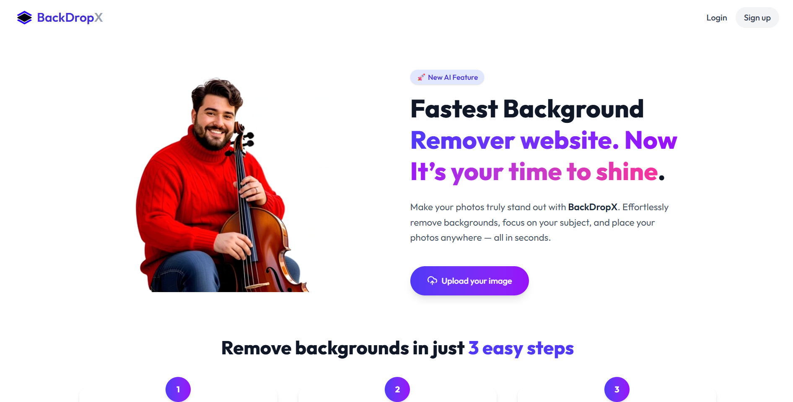

# BackDropX - AI Background Remover app

A production-ready, full-stack SaaS platform that provides AI-powered image background removal using the Clipdrop API. Built with modern technologies and designed for scalability, security, and monetization.

## First Look 

--
<p>- Click Below and watch the Demo</p>

<a href="https://youtu.be/DscXgud4YYk" target="_blank">
  
</a>


## Note 
It's just frontend part of this project right now which i added, i will add backend part soon.

## Overview

This application demonstrates a complete SaaS architecture with secure authentication, payment processing, and external API integration. Users can upload images, remove backgrounds using AI, and manage their usage through a credit-based system. The platform handles user authentication, payment processing, and provides a seamless user experience across web and mobile devices.

## Features

- **AI-Powered Background Removal**: Integration with Clipdrop API for high-quality image processing
- **Secure Authentication**: JWT-based authentication using Clerk with webhook support
- **Credit-Based System**: Track and manage user usage limits with automatic credit deduction
- **Payment Processing**: Seamless credit purchases via Razorpay integration
- **Image Processing**: Base64 encoding/decoding with secure file handling
- **Responsive Design**: Mobile-first UI built with Tailwind CSS
- **Error Handling**: Comprehensive error management for 401, 403, 411, and other scenarios
- **Scalable Architecture**: Modular code structure with reusable components

## Architecture

The application follows a microservices-inspired architecture with clear separation of concerns:

- **Frontend**: React.js SPA with component-based architecture
- **Backend**: Spring Boot REST API with layered architecture (Controller → Service → Repository)
- **Database**: MySQL for persistent data storage
- **Authentication**: Stateless JWT with Clerk identity provider
- **External Services**: Clipdrop API for image processing, Razorpay for payments
- **Development**: Ngrok for local webhook testing

## Tech Stack

### Frontend
- React.js 18+ with Vite build system
- Tailwind CSS for responsive styling
- Axios for HTTP client communication
- Lucide React for iconography
- Clerk SDK for authentication
- React Router DOM for navigation
- React Hot Toast for notifications

### Backend
- Spring Boot 3.x with Java 17+
- Spring Security with JWT filter chain
- Spring Data JPA with MySQL
- Feign Client for external API calls
- Maven for dependency management

### External Services
- **Clipdrop API**: AI-powered background removal
- **Razorpay**: Payment gateway integration
- **Clerk**: Authentication and user management
- **Ngrok**: Local development tunneling

## Installation

### Prerequisites
- Node.js 18+ and npm
- Java 17+ and Maven
- MySQL 8.0+
- Ngrok (for local webhook testing)

### Backend Setup

1. Clone the repository:
```bash
git clone https://github.com/arvindparaliya/BackDropX.git
cd BackDropX
```

2. Configure MySQL database:
```sql
CREATE DATABASE backdropx_db;
CREATE USER 'user'@'localhost' IDENTIFIED BY 'your_password';
GRANT ALL PRIVILEGES ON backdropx_db.* TO 'user'@'localhost';
```

3. Build and run the backend:
```bash
mvn clean install
mvn spring-boot:run
```

The backend will start on `http://localhost:8080`

### Frontend Setup

1. Navigate to the frontend directory:
```bash
cd ../frontend
```

2. Install dependencies:
```bash
npm install
```

3. Start the development server:
```bash
npm run dev
```

The frontend will start on `http://localhost:5173`

## Configuration

### Environment Variables

Create `.env` files in the respective directories:

#### Backend (`application.properties`)
```properties
# Database Configuration
spring.datasource.url=jdbc:mysql://localhost:3316/backdropx_db (defalut localhost:3306)
spring.datasource.username=user
spring.datasource.password=your_password

# Clipdrop API
clipdrop.api.key=your_clipdrop_api_key
clipdrop.api.url=https://clipdrop-api.co

# Razorpay Configuration
razorpay.key.id=your_razorpay_key_id
razorpay.key.secret=your_razorpay_secret

# Clerk Configuration
clerk.webhook.secret=your_clerk_webhook_secret
```

#### Frontend (`.env`)
```env
VITE_CLERK_PUBLISHABLE_KEY=your_clerk_publishable_key
VITE_RAZORPAY_KEY_ID=your_razorpay_key_id
VITE_API_BASE_URL=http://localhost:8080/api
```

### API Keys Setup

1. **Clipdrop API**: Register at [clipdrop.co](https://clipdrop.co) and obtain your API key
2. **Razorpay**: Create an account at [razorpay.com](https://razorpay.com) and get your key ID and secret
3. **Clerk**: Set up a project at [clerk.com](https://clerk.com) and configure authentication methods

### Webhook Configuration

For local development, use Ngrok to expose your localhost:

```bash
ngrok http 8080
```

Configure the Ngrok URL in your Clerk dashboard for webhook endpoints.

## Usage

### Basic Workflow

1. **User Registration/Login**: Users authenticate via Clerk integration
2. **Credit Management**: Users start with default credits or purchase additional credits
3. **Image Upload**: Users upload images through the web interface
4. **Background Removal**: Images are processed via Clipdrop API
5. **Download Results**: Processed images are available for download
6. **Credit Tracking**: Usage is automatically tracked and credits are deducted

### API Endpoints

#### User Management
- `GET /api/users/credits` - Retrieve user credit balance
- `POST /api/users/sync` - Sync user data from Clerk webhook

#### Image Processing
- `POST /api/images/remove-background` - Process image background removal

#### Payment Processing
- `POST /api/orders/create` - Create Razorpay order
- `POST /api/orders/verify` - Verify payment completion

### Frontend Components

- **MenuBar**: Navigation and user authentication status
- **Landing Page**: Marketing content and feature showcase
- **BgRemovalSteps**: Step-by-step process visualization
- **BgSlider**: Before/after image comparison
- **Pricing**: Credit packages and payment integration
- **Testimonials**: User feedback and social proof
- **TryNow**: Image upload and processing interface


### Key Implementation Details

- **JWT Authentication**: Custom security filter chain with stateless session management
- **Feign Clients**: Type-safe HTTP clients for external API integration
- **Error Handling**: Centralized exception handling with appropriate HTTP status codes
- **State Management**: React Context API for global state management
- **Component Architecture**: Reusable, modular components following React best practices

## Contributing

1. Fork the repository
2. Create a feature branch (`git checkout -b feature/amazing-feature`)
3. Commit your changes (`git commit -m 'Add amazing feature'`)
4. Push to the branch (`git push origin feature/amazing-feature`)
5. Open a Pull Request


Built with modern technologies and best practices for production-ready SaaS applications. Perfect for developers, freelancers, and startups building AI-driven image processing tools.
